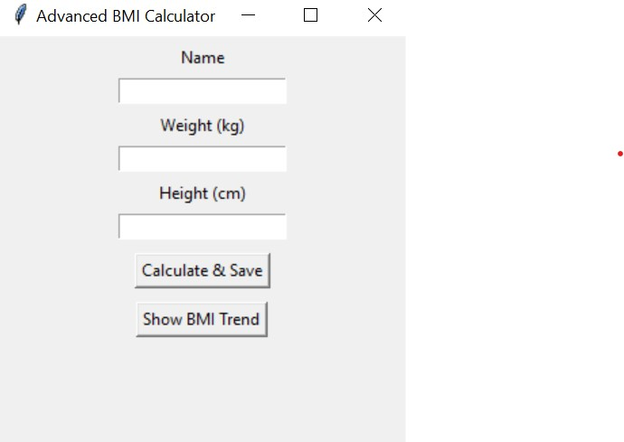
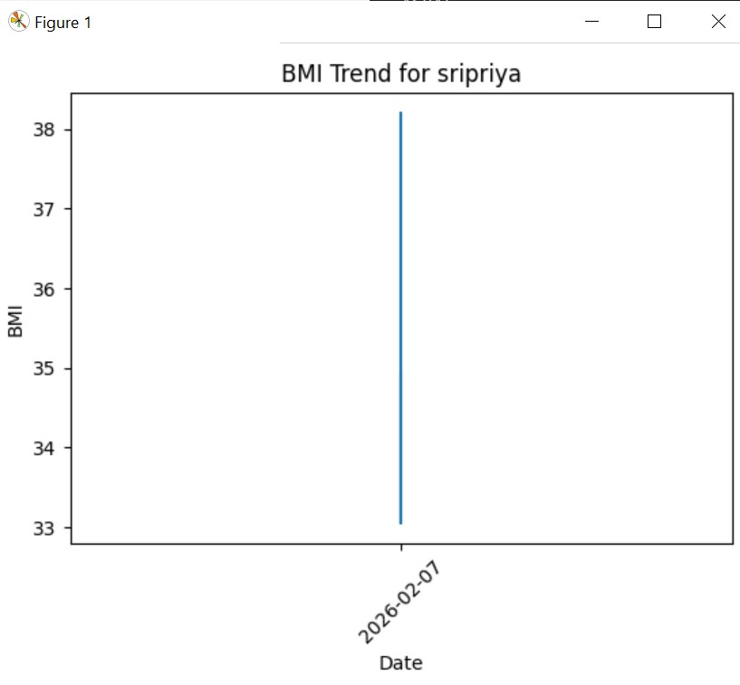

# Advanced BMI Calculator

## Screenshots

### GUI

### Graph

---

## Features
- GUI built using Tkinter
- BMI Calculation and categorization
- Input validation and error handling
- Multi-user data storage using CSV
- Historical BMI tracking
- Graph visualization using matplotlib

---

## Run Project

### Create virtual environment
python -m venv venv
venv\Scripts\activate

### Install dependencies
pip install -r requirements.txt

### Run application
python app.py